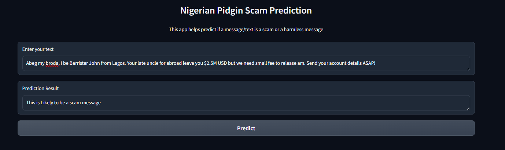
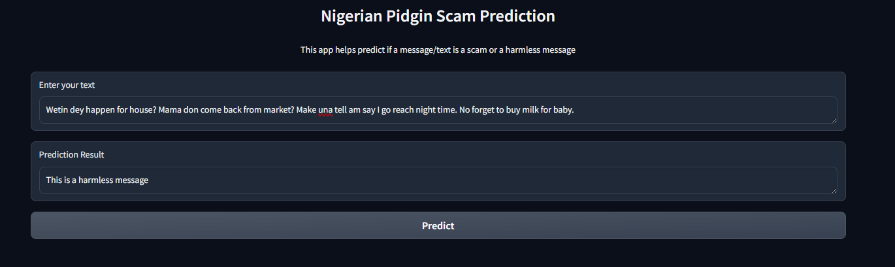

# Naija Pidgin Scam Detector

This project is designed to predict whether a given text in Nigerian Pidgin is a scam or a harmless message. It uses machine learning models to analyze the input text and provide a prediction.

## Project Structure

- `app/` - Contains the main application code.
  - `app.py` - The main script to run the application.
- `models/` - Directory for storing machine learning models.
- `data/` - Directory for storing datasets.
- `requirements.txt` - A file listing all the dependencies required for the project.

## Setup Instructions

1. **Create a Virtual Environment**
   
   Open a terminal and navigate to the project root directory. Run the following command to create a virtual environment:
   ```bash
   python -m venv venv
   ```

2. **Activate the Virtual Environment**
   
   - On Windows:
     ```bash
     .\venv\Scripts\activate
     ```
   - On macOS and Linux:
     ```bash
     source venv/bin/activate
     ```

3. **Install Dependencies**
   
   With the virtual environment activated, install the necessary dependencies:
   ```bash
   pip install -r requirements.txt
   ```

## Running the App

To start the application, run the following command:
```bash
cd app
python app.py
```

## Showcase

Testing the result of the application, with instances of scam messages and not scam messages.






